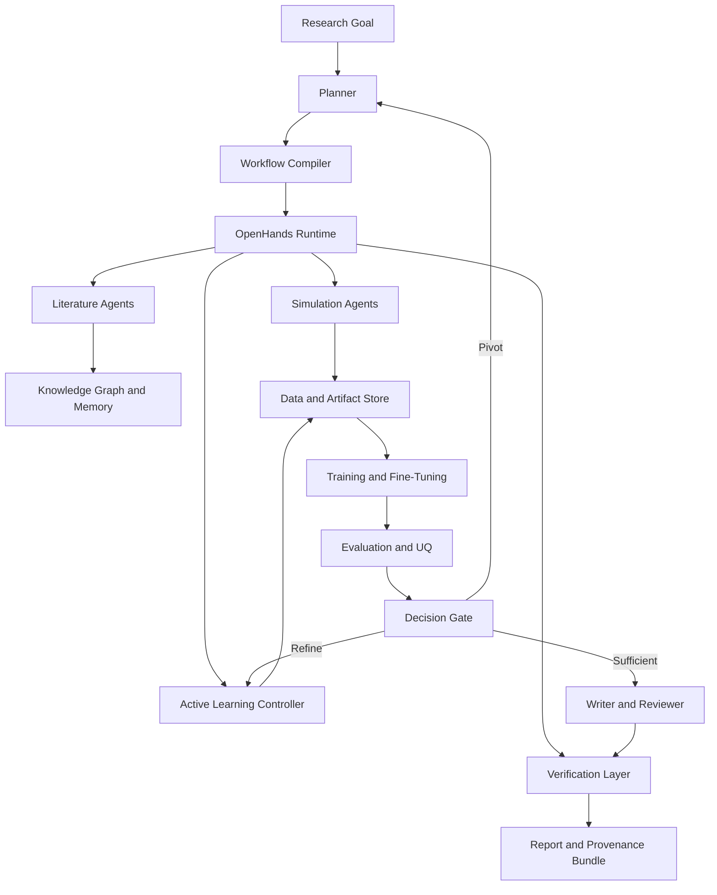
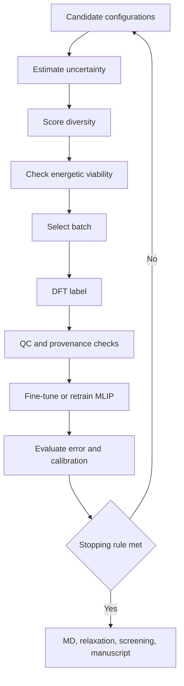

# Autonomous Active-Learning Scientist for ML Interatomic Potentials

## Executive summary

A good research agent for computational chemistry should behave less like an oracle and more like a careful lab apprentice: it should keep a notebook, respect instruments, admit uncertainty, recover from failed runs, and only make claims it can trace back to actual calculations. The most defensible repository plan is therefore **not** to invent a monolithic new harness from scratch, but to build a layered system: **OpenHands as the execution substrate**, **PARNESS-style declarative workflows and cross-run memory**, **Lang2MLIP-style sequential decision-making for MLIP development**, **AI Scientist-style experiment/paper loops**, and **AutoResearchClaw-style self-healing, verification, and human-gated recovery**. This composition matches where each source is strongest and avoids inheriting their known weaknesses wholesale. citeturn1search0turn21view2turn20view1turn22view0turn21view3

The recommended repository should target a specific but expandable mission: **autonomous active-learning and fine-tuning of foundation ML interatomic potentials for materials-focused atomistic workflows**, with an explicit path to molecular/reactive extensions. That choice is pragmatic because the most mature foundation models, benchmarks, and large open datasets are currently strongest in materials science, while ASE, LAMMPS, ORCA, Materials Project, OQMD, Matbench Discovery, and Open Catalyst provide an unusually rich tool-and-data ecosystem for reproducible automation. citeturn14search0turn11search1turn3search3turn13search9turn12search0turn24search6turn24search1turn11search2turn11search3turn8search0turn8search2turn8search21

The repository should optimize for five outcomes. First, **scientific grounding**: every numerical claim should point to a concrete artifact, log, or labeled structure. Second, **reproducibility**: every run should be reconstructable from a versioned workflow, immutable environment, pinned tools, and provenance bundle. Third, **adaptive research behavior**: the agent should decide when to refine, when to pivot, and when to stop. Fourth, **cost-aware throughput**: on Vessel Cloud, most iterative work should fit on A100 or H100 nodes, with B200 reserved for memory-heavy distillation or committee inference. Fifth, **safe agent operation**: sandboxed tools, human approval on expensive or risky steps, and transparent uncertainty reporting should be default rather than optional. citeturn21view3turn9search0turn9search1turn10search0turn10search1turn10search2turn7search13turn17view0turn17view2turn17view3

The central build recommendation is to create a repository that treats “research” as an auditable control problem. The agent should learn over time, but it should also leave behind enough structure that a skeptical human can re-run the workflow, inspect its decisions, and reject any unsupported conclusion. That posture is more likely to survive real computational chemistry workloads than a paper-only generator, and it is better aligned with both current autonomous-science evidence and current GPT-5.6 Sol best practices around tool use, guardrails, model selection, and staged multi-agent orchestration. citeturn19view0turn17view0turn17view3turn18view0turn17view2

## Goals and scope

The repository should be scoped as an **Autonomous Active-Learning Scientist for ML interatomic potentials** with four primary goals: literature-grounded problem framing, data-efficient MLIP development, self-correcting experiment execution, and submission-grade reporting with verified claims. AI Scientist and AI Scientist-v2 show that end-to-end idea → experiment → paper loops are now feasible, but their original implementation focus is machine-learning research rather than atomistic simulation. Lang2MLIP shows that end-to-end MLIP development can be cast as sequential decision-making driven by an LLM that observes data, model state, evaluation results, and logs, but it stops closer to “automated model development” than “automated scientific strategy.” This plan explicitly extends that frontier. citeturn22view0turn22view3turn20view1

The initial domain scope should be **materials and interfaces**, not because molecules are unimportant, but because the supporting ecosystem is more mature for autonomous loops. CHGNet is pretrained on more than 1.5 million inorganic structures from Materials Project trajectories; MACE foundation models target broad atomistic materials chemistry; ORB emphasizes speed and stable simulation in materials; SevenNet-Omni and MatterSim broaden multi-task and multi-condition coverage; Matbench Discovery and OC20/OC22 provide strong public evaluation anchors. Molecular and reactive specialization should be a second-phase extension through MACE-OFF, NequIP/Allegro variants, and domain-specific DFT labeling policies. citeturn11search1turn14search0turn3search3turn13search9turn12search0turn11search2turn11search10turn14search2turn23search0turn23search1

The operational scope should be narrow enough to finish and broad enough to matter. A realistic v1 target is: **fine-tune or active-learn a foundation MLIP for one family of solids, interfaces, or defective structures; use MD or relaxation to propose informative configurations; relabel selectively with DFT; retrain; quantify uncertainty; and produce a report with verified plots, tables, and provenance bundles**. This aligns with current evidence that active learning, uncertainty, and foundation-model fine-tuning are the highest-leverage levers for practical MLIP performance gains. citeturn4search1turn15search6turn15search0turn4search16turn13search21turn12search3

The out-of-scope list should be explicit. The first public version should avoid fully automated wet-lab protocol generation, unrestricted bio/chem dual-use planning, black-box literature synthesis without citations, and claims of “autonomous discovery” without human sign-off for expensive or safety-relevant computational steps. Nature’s Robin system is informative here: even a much stronger domain-specific scientific agent still uses a lab-in-the-loop pattern, consensus across multiple analysis trajectories, and guardrails around dual-use concerns and candidate safety. citeturn19view0

### Candidate harness comparison

| Harness | What it contributes | What it lacks for this repo | Verdict |
|---|---|---|---|
| **OpenHands SDK** | Mature coding-agent substrate with typed tools, event-sourced execution, sandboxed workspaces, security analysis, remote agent server, and an experimental critic for iterative refinement. citeturn1search0turn1search3turn1search5turn1search7turn1search10turn1search11 | No computational-chemistry research logic by default. | **Use as the execution kernel.** |
| **PARNESS** | Declarative YAML DAGs, full-PDF/body/figure/table indexing, code-repo indexing, and cross-run knowledge accumulation under a thin agent contract. citeturn0search1turn21view2 | Quality benchmarking is still limited; the paper emphasizes control-flow durability more than research-output quality. citeturn21view2 | **Borrow workflow DSL, memory, and paper-indexing ideas.** |
| **AI Scientist** | Cheapest clean end-to-end idea → code → experiment → paper loop; strong inspiration for artifact generation and reviewer stage. citeturn22view0turn22view2 | Machine-learning-paper assumptions; automated reviewer alone is not enough for scientific integrity in computational chemistry. citeturn22view4 | **Borrow paper/reviewer loop, not the full harness.** |
| **AI Scientist-v2** | Experiment manager, tree search, stronger open-ended iteration, figure refinement. citeturn22view1turn22view3 | Still centered on ML experiments, and still weaker than newer systems on failure recovery. citeturn21view3 | **Borrow experiment-manager logic.** |
| **Lang2MLIP** | Closest prior art for end-to-end MLIP development with action selection from dataset/model/eval/log state. citeturn20view1 | Focuses on MLIP development, not full scientific strategy, review, provenance, or claim verification. citeturn20view1 | **Borrow the MLIP decision loop.** |
| **AutoResearchClaw** | Pivot/Refine self-healing, result/citation verification, cross-run lessons, and human-in-the-loop gates. citeturn21view3 | Research-benchmark focus is ML-centric, not domain-specific to chemistry. citeturn21view3 | **Borrow failure recovery, verification, and oversight mechanisms.** |

### ML potential comparison

| Model family | Best current use in repo | Key evidence | Practical note |
|---|---|---|---|
| **MACE / MACE foundation models** | Default fine-tuning baseline and general-purpose teacher candidate. | MACE-MP-0 is positioned as an out-of-the-box foundation model for atomistic systems and supports stable MD on a wide range of molecules and materials; MACE docs also expose foundation and organic-force-field variants. citeturn14search0turn14search3turn14search13turn14search2 | Best v1 default. |
| **CHGNet** | Strong materials baseline, especially where charge-informed behavior is useful. | CHGNet is pretrained on Materials Project trajectories spanning over a decade of DFT and more than 1.5 million inorganic structures. citeturn11search1turn24search0 | Excellent inorganic benchmark anchor. |
| **ORB** | Fast committee member or screening model. | ORB reports 3–6× speedups over existing universal potentials and improved Matbench Discovery error at release. citeturn3search3 | Good for cheap broad exploration. |
| **SevenNet / SevenNet-Omni** | Multi-GPU MD and scalable committee inference. | SevenNet supports efficient multi-GPU parallel MD with LAMMPS; SevenNet-Omni/Nano extend universal and distilled variants. citeturn13search0turn3search14turn13search4turn13search9 | Attractive when parallel MD is central. |
| **MatterSim / MatterSim-MT** | Materials under wider temperature/pressure regimes; auxiliary property heads. | MatterSim positions itself as a deep-learning atomistic model across elements, temperatures, and pressures, and MatterSim-MT expands multi-task outputs such as charges and dielectric properties. citeturn12search10turn12search0turn12search21 | Strong optional branch for advanced materials tasks. |
| **GRACE** | Accuracy/efficiency comparison arm and distillation target. | GRACE is presented as a robust foundational interatomic-potential family with a strong Pareto angle on accuracy versus efficiency. citeturn12search2turn12search5 | Good comparative baseline. |
| **NequIP / Allegro** | Molecular/reactive extension path; high-efficiency local architecture. | NequIP is highly data-efficient; Allegro is strictly local, accurate, and scalable, with integration into ASE and LAMMPS. citeturn23search0turn23search1turn23search6turn23search12 | Best for v2 molecular/reactive branch. |

## Architecture and harness selection

The repository should use a **stacked architecture**, not a single borrowed framework. The substrate should be OpenHands because it already provides the core ingredients that autonomous computational chemistry needs most urgently: typed tools, event-driven state, sandboxed local/Docker/remote workspaces, security validation, and critic-style iterative refinement hooks. On top of that substrate, the repo should implement a **PARNESS-like workflow layer** as YAML-defined DAGs, because research loops differ by domain and should remain editable without deep code changes. Above that, the scientific loop should adopt **Lang2MLIP’s stateful action-selection pattern**, while **AutoResearchClaw** provides the operational rules for failure handling, verification, and escalation. citeturn1search0turn1search3turn1search5turn1search7turn21view2turn20view1turn21view3



This architecture is justified by the source landscape. OpenHands gives a robust execution core; PARNESS demonstrates that declarative pipelines and cross-run knowledge are natural fits for autonomous research; Lang2MLIP demonstrates that MLIP development benefits from action selection based on current dataset/model/evaluation state; AI Scientist-v2 shows the value of an experiment manager and iterative search; AutoResearchClaw shows that self-healing, verification, and targeted human intervention materially improve research-agent outcomes. citeturn1search0turn21view2turn20view1turn22view3turn21view3

### Repository component plan

| Component | Role | Expected impact | Evidence-based justification |
|---|---|---|---|
| **Execution kernel** | OpenHands conversations, tools, workspace, events, critic. | **Very high** | OpenHands already exposes typed tools, stateless reasoning-action loops, append-only event logs, sandboxed workspaces, and critic-based iterative repair, which are exactly the capabilities needed for auditable scientific tooling. citeturn1search0turn1search5turn1search7turn1search8turn1search10turn1search11 |
| **Workflow DSL** | YAML DAGs for literature review, screening, labeling, retraining, review. | **High** | PARNESS shows declarative DAGs reduce framework rigidity and allow new research loops to be expressed without rewriting the kernel. citeturn0search1turn21view2 |
| **Knowledge layer** | Full-text paper index, figure/table chunks, code-repo links, cross-run lesson store. | **High** | PARNESS emphasizes full-PDF access and cross-run knowledge as missing pieces in earlier research agents; Robin and OpenAI reasoning guidance both support strong performance when agents can reason over large, dense document corpora. citeturn21view2turn19view0turn17view1 |
| **Scientific planner** | Converts user goal into hypotheses, target systems, budgets, and stopping rules. | **High** | Lang2MLIP and Robin both succeed by making decisions conditional on current evidence and domain state rather than following a fixed recipe. citeturn20view1turn19view0 |
| **Active-learning controller** | Chooses candidates by uncertainty, diversity, energetic viability, and budget. | **Very high** | Recent MLIP literature repeatedly identifies active learning and uncertainty-driven exploration as central to reliable data-efficient training. citeturn4search1turn15search6turn15search8turn15search0 |
| **Verification layer** | Claim registry, citation checks, plot/data traceability. | **Very high** | AutoResearchClaw’s strongest integrity contribution is verifiable result reporting; this is especially important in computational chemistry, where plot hallucinations or unlabeled DFT settings can invalidate conclusions. citeturn21view3 |
| **Writer/reviewer** | Drafts report, reviewers challenge unsupported claims, humans approve. | **Medium to high** | AI Scientist and AI Scientist-v2 show this stage is now tractable, but Robin and AutoResearchClaw show that consensus and oversight are still needed for scientific credibility. citeturn22view0turn22view1turn19view0turn21view3 |

### Research loop decision logic



This decision logic reflects the strongest consensus in the MLIP literature: uncertainty alone is not enough; diversity matters; energetic plausibility filters prevent wasting labels on unphysical regions; and stopping should depend not just on raw MAE but also on calibration and downstream stability under simulation. citeturn4search1turn15search0turn15search6turn4search4

The README and docs should also embed a small curated figure set from public sources: the PARNESS workflow schematic, the AutoResearchClaw pipeline overview, and a materials benchmark or model-comparison figure from Matbench Discovery. Those figures already communicate the architectural separation between orchestration, execution, and evaluation, and they will make the repo more legible to reviewers. citeturn21view2turn21view3turn11search2

## Domain SKILLs to reuse and new SKILLs to build

In this plan, a **SKILL** is a typed, reusable capability exposed to the agent as a bounded tool or subworkflow with clear inputs, outputs, validation rules, and provenance logging. The right design principle is to **reuse mature scientific infrastructure wherever possible** and only build genuinely agent-specific capabilities where existing software does not already solve the problem. That strategy follows both the engineering lesson from OpenAI’s guidance to maximize capability before adding orchestration complexity and the scientific lesson from Robin and Lang2MLIP that domain progress comes mostly from how tools are coordinated, not from replacing well-tested tools with novel wrappers. citeturn17view0turn19view0turn20view1

### Domain SKILLs to reuse

| Reuse SKILL | Tooling choice | Why reuse it | Expected impact |
|---|---|---|---|
| **Structure I/O and manipulation** | ASE, pymatgen | ASE is the standard Python bridge for setting up, running, and analyzing atomistic simulations across calculators. citeturn8search0turn8search4 | High |
| **DFT and semiempirical labeling** | ORCA, optional xTB via external wrappers | ORCA is a mature academic quantum-chemistry package spanning DFT to multireference methods and is practical for molecular and small-cluster labels. citeturn8search21turn8search9 | High |
| **Atomistic dynamics and relaxation** | LAMMPS | LAMMPS is the de facto high-performance engine for large-scale MD, and several MLIP stacks already integrate with it. citeturn8search2turn8search18turn13search0turn23search12 | Very high |
| **Cheminformatics for molecular branch** | RDKit | RDKit remains the practical standard for molecular parsing, feature extraction, and conformer-oriented preprocessing. citeturn8search3turn8search7 | Medium |
| **Foundation MLIP backends** | MACE, CHGNet, ORB, SevenNet, MatterSim, GRACE | The point is not to reinvent MLIPs but to orchestrate them. The literature now supports foundation/fine-tuning workflows across these families. citeturn14search0turn11search1turn3search3turn13search9turn12search0turn12search2 | Very high |
| **Open datasets and benchmarks** | Materials Project, MPtrj, OQMD, Matbench Discovery, OC20/OC22 | These resources provide public, community-recognized anchors for both initialization and evaluation. citeturn24search6turn24search0turn24search1turn11search2turn11search10 | Very high |

### New SKILLs to build

| New SKILL | What it does | Why it is new | Expected impact | Justification |
|---|---|---|---|---|
| **Hypothesis-to-campaign compiler** | Turns a natural-language problem into target systems, property goals, label budgets, and stop criteria. | Existing frameworks stop short of chemistry-native campaign compilation. | **Very high** | Lang2MLIP chooses actions, but the broader research-goal translation still needs explicit domain structure. citeturn20view1 |
| **AL acquisition policy mixer** | Learns when to emphasize uncertainty, diversity, committee disagreement, or energetic plausibility. | Off-the-shelf AL is usually static. | **Very high** | Recent MLIP active-learning work shows no single selection rule dominates across systems. citeturn15search0turn15academia19 |
| **DFT failure triage** | Diagnoses SCF failures, geometry explosions, spin/pathology flags, and basis/functional mismatch. | Chemistry failure handling is domain-specific and underdeveloped in general harnesses. | **High** | AutoResearchClaw shows failure recovery matters; ORCA’s breadth makes structured triage especially valuable. citeturn21view3turn8search21 |
| **OOD and calibration auditor** | Detects when the MLIP is leaving its trust region using committee spread, evidential signals, and runtime diagnostics. | Foundation models still extrapolate; calibration is not solved. | **Very high** | UQ is repeatedly highlighted as a core bottleneck for trustworthy MLIPs. citeturn4search1turn4search4turn4search17 |
| **Scientific claim registry** | Ensures every paper number, table entry, or plot trace links to a concrete artifact. | Existing writer loops often lack strict grounding. | **Very high** | AutoResearchClaw’s strongest novelty is result/citation verification. citeturn21view3 |
| **Run crate generator** | Emits RO-Crate + PROV-O + DVC + MLflow bundle for each run. | This level of machine-readable provenance is uncommon in agent repos. | **High** | FAIR, RO-Crate, and PROV-O offer a strong standard base for reproducibility. citeturn10search0turn10search1turn10search2 |

A practical repo layout should mirror this separation:

```text
repo/
  agents/
  workflows/
  skills/
    literature/
    atomistics/
    dft/
    mlip/
    al/
    verification/
  models/
  configs/
  data_registry/
  provenance/
  docker/
  ci/
  docs/
```

The important point is that **skills should be typed and unit-testable outside the LLM**, while agents should mostly decide *which* skill to call, *when*, and *with what budget*. That keeps the unpredictable part small and the scientific tooling auditable. citeturn1search11turn17view0

## Failure recovery, reproducibility, and evaluation

### Failure-recovery mechanisms

Computational chemistry fails in wonderfully repetitive ways: SCF cycles diverge, MD blows up, cell optimizations collapse into nonsense, fine-tuning overfits, and foundation models produce deceptively smooth trajectories in out-of-domain regions. The repo should therefore make **failure a first-class object**. AutoResearchClaw’s Pivot/Refine logic is the right template: after a failed or suspicious step, the system should diagnose, preserve artifacts, attempt a bounded repair if the failure is local, and pivot only when evidence suggests the current path is structurally unsound. citeturn21view3

| Failure class | Detection rule | Refine action | Pivot action |
|---|---|---|---|
| SCF non-convergence | Parser sees iteration cap / oscillation / NaN in ORCA logs | Adjust SCF settings, guess, damping, spin init, geometry pre-relaxation | Switch label method or reduce system complexity |
| MD instability | Energy/temperature spikes, exploding forces, nonphysical bond lengths | Reduce timestep, thermostat change, short anneal, tighter cutoff checks | Pull new labels near the unstable region and retrain |
| OOD model behavior | Committee spread or evidential uncertainty exceeds threshold | Query more labels in neighborhood | Replace backbone or narrow scope |
| Weak calibration | Error vs uncertainty decouples on holdout or replay set | Retrain calibration head / ensemble | Change UQ method or committee composition |
| Overfitting in fine-tuning | Validation force error worsens while train improves | Freeze more layers, lower LR, reduce epochs | Swap teacher model family |
| Unsupported claims in draft | Claim registry has no backing artifact | Remove or regenerate claim/table | Re-run experiment with explicit artifact link |

This design is not merely aesthetic. Active-learning papers show that uncertainty-aware exploration reduces pathological predictions, and recent UQ work for interatomic potentials argues that trustworthy deployment depends on distinguishing familiar from risky configurations. AutoResearchClaw adds the complementary systems lesson that execution recovery and explicit verification improve final outcomes more than simple retry loops. citeturn15search6turn4search1turn4search4turn21view3

### Reproducibility and CI/CD strategy

The reproducibility stack should combine **Git + DVC + MLflow + containerized runners + machine-readable provenance**. DVC is well-suited for versioning pipeline stages and data dependencies; MLflow complements it by tracking parameters, metrics, model lineage, and searchable run metadata; GitHub Actions with self-hosted GPU runners is the practical path for CI on GPU-dependent tests; and OpenHands’ sandbox/runtime model fits naturally into containerized execution. citeturn9search0turn9search1turn9search13turn9search2turn9search5turn1search3

The CI/CD design should have three layers. The first layer is **fast CI** on pull request: linting, unit tests, skill-schema validation, prompt-template validation, parser tests, provenance-schema tests, and smoke tests on tiny CPU or CUDA stubs. The second layer is **nightly GPU CI**: one short A100/H100 run that executes a minimal AL loop, fine-tunes a small model, and verifies artifact generation. The third layer is **release CI**: frozen container images, pinned configs, signed model cards, and reproducibility replays of one canonical benchmark run. This separation keeps ordinary developer iteration fast while still proving that the full scientific stack works end to end. citeturn9search0turn9search1turn9search5turn1search3

Every run should emit a provenance crate containing: Git SHA; workflow YAML version; image digest; CUDA/tool versions; model ID and reasoning settings; prompts and tool-call hashes; dataset manifest; label source metadata; random seeds; evaluation metrics; and the final claim registry. FAIR explicitly extends beyond raw data to the algorithms, tools, and workflows that produced that data; RO-Crate and PROV-O provide a practical representation for that broader provenance object. citeturn10search0turn10search1turn10search2

### Data provenance policy

The provenance policy should distinguish **external truth**, **derived truth**, and **agent text**. External truth includes public datasets such as Materials Project, OQMD, MPtrj, OC20, benchmark labels, and primary literature. Derived truth includes structures, labels, MD trajectories, fine-tuned checkpoints, uncertainty estimates, and ranked candidate batches. Agent text includes plans, summaries, rationales, and draft prose. Only the first two categories should be allowed to justify numerical scientific claims; agent text may explain decisions, but it should never be treated as evidence. That separation sharply reduces the risk of narrative drift. citeturn24search6turn24search1turn11search10turn10search0turn21view3

### Evaluation metrics and experiment matrix

The evaluation strategy should score both **scientific utility** and **agentic reliability**.

| Metric family | Primary metrics | Why it matters |
|---|---|---|
| **Model accuracy** | Energy MAE/RMSE, force MAE/RMSE, stress MAE | Standard MLIP quality measures. citeturn14search16turn23search0 |
| **Simulation robustness** | Stable MD fraction, relaxation success rate, no-blow-up steps, constraint adherence | A low-MAE model can still be unusable in MD. citeturn14search0turn3search3 |
| **AL efficiency** | Labels to target error, gain over random sampling, wall-clock to convergence | Active learning is justified only if it reduces label burden. citeturn15search0turn15search8 |
| **Uncertainty quality** | Calibration error, AUROC for error detection, risk-coverage curves | UQ is central to safe deployment and AL acquisition. citeturn4search1turn4search4 |
| **Agent reliability** | Failure-recovery rate, checkpoint resume success, claim-verification pass rate | Scientific agents must survive messy runs. citeturn21view3 |
| **Reproducibility** | Bitwise or tolerance-based replay success, provenance completeness, dataset lineage completeness | Scientific value collapses if runs cannot be replayed. citeturn9search0turn10search0turn10search1 |

| Experiment | Backbone | AL policy | UQ method | Domain | Success criterion |
|---|---|---|---|---|---|
| Baseline | MACE foundation | None or random | None | Matbench/Materials Project subset | Establish static fine-tune floor |
| AL core | MACE foundation | Uncertainty | Ensemble | One material family | Reach target force error with fewer labels |
| AL hybrid | MACE foundation | Uncertainty + diversity | Ensemble | Same family | Beat random and uncertainty-only on sample efficiency |
| Fast committee | ORB + CHGNet + MACE | Committee disagreement | Cross-model spread | Same family | Better OOD detection than single-model UQ |
| Scalable MD | SevenNet | Hybrid | Ensemble | Larger supercells | Preserve stability under longer MD |
| Advanced materials | MatterSim or GRACE | Hybrid | Ensemble/evidential | High-T/high-P or defects | Test whether richer foundation heads help |
| Failure study | Best two models | Hybrid | Best UQ | Same family | Higher recovery and lower hallucinated claims under induced failures |

This matrix is deliberately modest. It prioritizes *comparability* over breadth, and it is designed to produce a publishable story even if only the first three rows complete. That is the right bias for a new repo: strong baselines, limited variables, and measurable ablations. citeturn11search6turn15search0turn4search1turn21view3

## Compute, cost, safety, and GPT-5.6 Sol alignment

On Vessel Cloud, the publicly listed on-demand prices are currently **A100 80GB at $1.55/hr, H100 80GB at $2.39/hr, and B200 192GB at $5.50/hr**. A simple 24-hour full-GPU experiment therefore costs about **$37.20 on A100**, **$57.36 on H100**, or **$132.00 on B200** in raw GPU time; a 72-hour campaign costs about **$111.60**, **$172.08**, or **$396.00**, respectively. That cost profile strongly suggests using A100 for smoke tests and medium fine-tunes, H100 for default campaign runs, and B200 only when larger committees, large-batch distillation, or memory-heavy models justify the premium. citeturn7search13turn25calculator1turn25calculator0turn26calculator0turn25calculator5turn25calculator4turn26calculator1

A realistic budget envelope for a v1 campaign is therefore: short screening and parser validation on A100, one main AL loop on H100, and DFT labeling on CPU or separate chemistry infrastructure. Because many quantum-chemistry labels remain CPU-bound or license-bound, **GPU costs will often not dominate the total wall clock**; the repo should therefore schedule DFT as an asynchronous job queue with strict approval gates and cached duplicate detection, rather than treating labeling as a trivial inner loop. ORCA’s breadth is valuable, but its computational profile argues for budget-aware orchestration rather than “always label more.” citeturn7search13turn8search21turn8search9

### Security and safety considerations

The security boundary should begin with the workspace. OpenHands already treats workspaces as sandboxed execution environments and applies security validation to actions; that should be complemented by container allowlists, read-only mounts for external corpora, secrets isolation, and a policy that domain tools cannot open unrestricted outbound network access during expensive or license-sensitive calculations. citeturn1search3turn1search8turn1search10

The scientific-safety boundary should begin with the claim system. The repo should refuse to emit abstract, conclusion, or figure captions that contain unregistered numerical claims. AutoResearchClaw’s verifiable reporting is the right inspiration, and Robin’s lab-in-the-loop model is the right social contract: the most consequential decisions stay auditable and interruptible, and high-risk tool use is not silently delegated. citeturn21view3turn19view0

### Alignment with GPT-5.6 Sol guidance

No public document was found that spells out a dedicated, standalone **“GPT-5.6 Sol guideline”** for scientific-agent repositories in the exact form implied by the request. The safest reading is therefore to align with the public OpenAI materials that do exist: the GPT-5.6 model guidance, the agent-building guide, the multi-agent guide, the reasoning best-practices guide, the Model Spec, and the GPT-5.6 safety/system-card material. Those sources consistently favor clear task structure, intentional reasoning-effort selection, restrained use of multi-agent decomposition, strong tool definitions, layered safeguards, and human oversight for consequential actions. citeturn17view3turn17view0turn18view0turn17view1turn5search1turn17view2

For this repo, that translates into six concrete rules. Use **GPT-5.6 Sol** only for frontier reasoning moments such as planning, contradiction resolution, failure triage, and final synthesis; use smaller models or deterministic code for routine parsing and schema transforms. Start with a **single manager agent**, and expand into multiple subagents only where the work splits cleanly into bounded independent tasks. Set reasoning effort **intentionally**, with `medium` as a default and `high`/`xhigh`/`max` reserved for measured gains on hard tasks. Preserve **transparency** by logging tool calls, uncertainty estimates, and approval boundaries. Preserve **human oversight** at expensive DFT, scope pivots, and publication claims. Preserve **safe tool use** by limiting what any spawned subagent can execute. citeturn17view0turn17view3turn18view0turn17view2

## Thesis, antithesis, and synthesis

The thesis of this plan is simple: combine the best existing harness ideas into a research-agent repository that behaves like a reproducible computational-chemistry lab, not like a paper generator. The strongest counterarguments are worth taking seriously, because each reveals a real risk.

| Thesis | Antithesis | Synthesis |
|---|---|---|
| **A composed stack is better than a new monolith.** | The design may become too complex: OpenHands + PARNESS + Lang2MLIP + AutoResearchClaw could create an unmaintainable system. | Narrow the integration boundary. **OpenHands becomes the only runtime dependency**; PARNESS, Lang2MLIP, AI Scientist, and AutoResearchClaw are treated as **design patterns**, not full runtime forks. The public repo should ship one canonical workflow family first, not a framework zoo. citeturn1search0turn21view2turn20view1turn21view3 |
| **Active learning should be the core loop.** | Active learning may be overrated for foundation models; simple fine-tuning on a curated set may already solve many practical tasks with less orchestration overhead. | Make AL conditional, not dogmatic. The repo should support **fine-tune-only**, **AL-from-foundation**, and **committee screening** modes. Human-approved problem templates decide which mode to use. This matches recent evidence that fine-tuning can already deliver near-ab initio gains, while AL matters most when calibration or OOD behavior still limits downstream simulation. citeturn4search16turn13search21turn15search6turn4search1 |
| **A writer/reviewer layer is necessary.** | Writing layers tempt agents to oversell weak science; effort spent on prose could be better spent on verification and replayability. | Demote writing until the end. The refined plan makes **verification precede writing**, and the writer can only consume registered claims and provenance-backed figures. The manuscript layer becomes a rendering stage over grounded artifacts, not a source of scientific truth. This is directly inspired by AutoResearchClaw’s verified reporting and by the limitations observed even in stronger autonomous-science systems. citeturn21view3turn19view0turn22view4 |

This dialectic leads to a sharper final design. The repository should not aim to be “the universal autonomous scientist.” It should aim to be **the best auditable active-learning scientist for MLIPs in a bounded domain**, with explicit success criteria, reproducible execution, and graceful failure handling. That refinement improves feasibility, improves reviewer trust, and reduces the chance that the project collapses under its own ambition. citeturn17view0turn20view1turn21view3

## Prioritized roadmap

| Phase | Timeline | Deliverables | Exit criteria |
|---|---|---|---|
| **Foundation** | **Week 1** | Repo skeleton, OpenHands runtime integration, workflow YAML schema, ASE/LAMMPS/MACE baseline skills, provenance schema. | A tiny end-to-end run completes with artifacts and logs. |
| **Scientific baseline** | **Week 2** | MACE fine-tune workflow, Materials Project/OQMD loaders, Matbench-style evaluation harness, claim registry prototype. | Static fine-tune baseline is reproducible and replayable. |
| **Active-learning core** | **Week 3** | Uncertainty/diversity acquisition, committee mode, checkpoint resume, failure triage for MD and training. | AL beats random on at least one bounded benchmark. |
| **Verification and review** | **Week 4** | Verified plot/table writer, reviewer agents, human approval gates, release-quality docs and model cards. | Every reported claim maps to registry-backed artifacts. |
| **Stretch branch** | **Week 5 and beyond** | SevenNet or ORB committee arm, MatterSim/GRACE comparison, molecular/reactive branch with NequIP/Allegro or MACE-OFF. | One comparative paper-ready result beyond the default MACE branch. |

The first public milestone should not be “a paper.” It should be **a replayable benchmark campaign** with a report that can be regenerated from scratch. Only after that exists should the repository prioritize broader model coverage, more ambitious literature mining, or more autonomous manuscript generation. That ordering is grounded in both engineering reality and the broader research-agent literature: control-flow durability, verifiability, and domain-specific constraints are what make these systems useful outside demos. citeturn21view2turn21view3turn19view0

The resulting repository would be new in a meaningful sense. It would not merely combine agent buzzwords with chemistry tooling; it would operationalize a specific scientific stance: **trust is earned through replayability, bounded autonomy, and evidence-linked claims**. That is the most credible way to build an autonomous active-learning scientist for ML interatomic potentials today. citeturn10search0turn21view3turn17view2